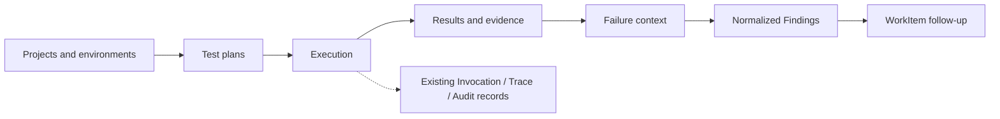
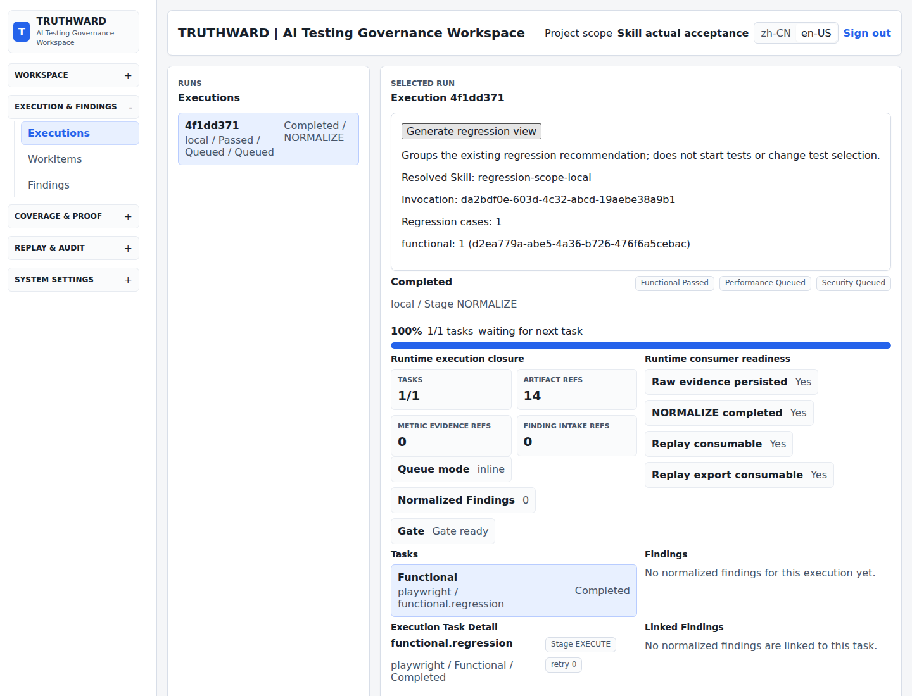
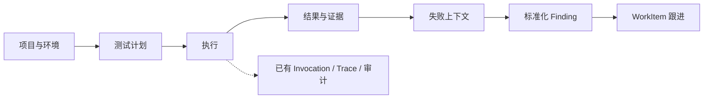

<h1 align="center">TRUTHWARD · 谛序</h1>

<p align="center"><strong>Community</strong></p>

<p align="center">
  <a href="#english">English</a> · <a href="#简体中文">简体中文</a>
</p>

## English

Self-hosted AI testing platform · Evidence-grounded execution and failure analysis

Keep the normal testing workflow—projects and environments, test plans, execution, results,
and issue follow-up—in one workspace. TRUTHWARD uses evidence from actual runs as the
connecting thread, so failures can progress from recorded context to normalized Findings
and actionable WorkItems instead of ending as disconnected logs or screenshots.

Community provides the self-hosted foundation of this workflow. The broader platform builds
on the same records for governed failure attribution, release decisions, replay, and audit.

[Quick start](#quick-start) · [First steps](#first-steps) · [User guide (Chinese)](docs/OSS_USER_GUIDE.md)

### Why TRUTHWARD

- **Run a complete testing workflow**: organize project and environment scope, create plans, execute tests, inspect results, and follow up on issues.
- **Preserve evidence at the source**: connect tasks, artifacts, failure context, Invocations, Traces, and existing audit details produced by actual runs.
- **Turn failures into structured work**: normalize tool output into Findings and carry confirmed issues into WorkItems instead of leaving investigation in raw logs.
- **Use AI and extensions under control**: bind models by scope and let Services authorize and manage structured Agent and Skill requests.



Execution, evidence, and failure analysis are not separate products: they are successive
parts of one testing workflow. Models, Skills, runners, and governance controls support
that workflow; they are not substitutes for it.



Isolated acceptance instance: local Skill grouping and Invocation records after a real Playwright functional execution. The screenshot shows the Chinese interface.

### Available capabilities

| Capability | What Community provides |
| --- | --- |
| Local identity | First-admin setup, login/logout, revocable tokens, local users, and fixed project roles |
| Projects and environments | Creation, configuration, membership management, and project scope selection |
| Tests and issues | Test plans, restricted execution/cancellation, Findings, and WorkItem tracking |
| Traceability | Workflows, execution records, audit event details, runtime observations, and read-only analysis of existing data |
| Model bindings | Project/environment configuration with PRIMARY, CHALLENGER, JUDGE, and LOCAL_FALLBACK roles |
| Controlled Skills | Trusted local JSON registration; explicit enable/disable for regression presentation bindings, business workflow calls, and Invocation observation |
| SCM configuration | Scoped GitHub/GitLab bindings and safe configuration projections |

See the [Community user guide (Chinese)](docs/OSS_USER_GUIDE.md) for workflows and current limitations.

### Quick start

These steps target a **fresh, single-instance installation on Linux using Bash**.
The verified environment is Ubuntu 24.04 with Python 3.12.
This procedure does not upgrade an existing database, and no prebuilt application image is provided.

#### 1. Prepare the environment

- Python 3.11–3.14; `backend/pyproject.toml` defines the supported range.
- Node.js 22.13+ or Node.js 24 LTS, plus npm. Release evidence is produced with Node.js 22.
- Docker Engine and Compose v2 to run PostgreSQL 16 and Redis 7.
- Network access to dependency registries and container image registries.

Database initialization runs directly in Python using the PostgreSQL driver installed with the backend dependencies.
Windows uses the same source package; see the [Windows compatibility notes (Chinese)](docs/COMMUNITY_INSTALLATION.md#windows-兼容说明).

Extract the Community source package and enter the root directory containing this README.
Keep the full directory, including `schemas/contracts/`, `DB_SCHEMA.sql`, `scripts/migrations/`, and `community-skills/`.
Do not copy only the backend directory or replace the source runtime directory with a wheel.

#### 2. Create a Python environment

```bash
python3 -m venv backend/.venv
source backend/.venv/bin/activate
```

All subsequent `python` commands refer to this virtual environment. Activate it in any new terminal that runs Python commands.

#### 3. Generate configuration and install dependencies

```bash
python scripts/community.py configure
python -m pip install --require-hashes -r backend/requirements.lock
npm --prefix frontend ci
```

The configuration command checks the Python version, generates separate random database and Redis passwords,
and writes a local `.env` file. It refuses to overwrite an existing `.env`.
This does not create an application account; there is no shared administrator password.

#### 4. Start dependencies and initialize an empty database

```bash
docker compose --env-file .env -f compose.community.yml up -d --wait
python scripts/community.py init-db
python scripts/community.py doctor
```

PostgreSQL defaults to local port `55432` and Redis to `56379`; both bind only to `127.0.0.1`.
If those ports are occupied, use `configure --database-port 55433 --redis-port 56380` when first generating configuration.

Initialization verifies the bundled SQL checksum manifest and records each successful migration in the database ledger.
**It refuses to run when existing application tables are found and does not delete data.**
Do not run `init-db` against an existing deployment or delete a database to resolve initialization or login errors.
`doctor` performs credential-safe read-only checks of the Community profile, source assets,
tooling, database connection, and exact migration ledger. It does not repair or migrate data.

#### 5. Start the backend and frontend

In the first terminal, from the source root with the Python environment activated:

```bash
python scripts/community.py serve
```

In a second terminal, from the source root:

```bash
npm --prefix frontend run dev -- --mode oss --host 127.0.0.1
```

Open the [workspace](http://127.0.0.1:5173). Use the backend [API documentation](http://127.0.0.1:8000/docs)
and [health endpoint](http://127.0.0.1:8000/api/v1/health) to troubleshoot startup.
The API serves only Community routes. Demo credentials such as `admin-token` and `user-token` cannot authenticate.

For an installation on a remote Linux server, open another terminal on your own computer and establish an SSH tunnel.
Replace `user@your-server` with your server login address, then open the localhost URLs above:

```bash
ssh -N -L 5173:127.0.0.1:5173 -L 8000:127.0.0.1:8000 user@your-server
```

#### 6. Stop the local instance

Press Ctrl+C in both application terminals, then stop the dependencies:

```bash
docker compose --env-file .env -f compose.community.yml stop
```

This preserves database volumes and local files. Avoid commands that remove volumes unless you intend to delete their data.
See the [installation and operations guide (Chinese)](docs/COMMUNITY_INSTALLATION.md) for backups, external databases, and public deployment considerations.

### First steps

1. Create an administrator on the first-start page with a password of at least 12 characters. Keep your username or email.
2. Create a project and an environment. The top project selector appears only when multiple projects exist.
3. Add an available provider in model configuration, bind roles, and run a connection check.
4. In Workflow, create a test plan with a real browser assertion template, target URL, and element locator, then start its functional execution.
5. Inspect the Execution status, failure reasons, and evidence. Follow up on Findings or create a WorkItem.
6. Expand audit event details to inspect the objects, statuses, linked IDs, and redacted data actually recorded.

**A successful base installation does not mean that models and all test tools are ready.**
Configure API keys, providers, browsers, or scanners for the test types you need.
Missing dependencies must appear as unavailable/failed; they do not constitute a passing test.
The browser form provides visibility and text assertions. Simulated tasks are not evidence that a business test passed.
Start with the [runnable browser example](examples/community-browser/README.md): it supplies a local target,
a complete plan, and a script that checks the actual task and its report, screenshot, and trace.
Then find the saved Execution and artifacts in the UI. A missing dependency or failed assertion must remain visible as a failure.
See [real browser execution (Chinese)](docs/COMMUNITY_INSTALLATION.md#真实浏览器执行) for browser installation and setup.

### Use your own AI models

Model configuration prefers an environment binding, then falls back to the project default.
A project can configure multiple models with different roles.
Secrets are supplied through runtime environment or credential references and are not returned in configuration listings.

Role bindings do not mean that every run calls every model, and successful configuration does not prove that a real provider request succeeded.
Check both connection results and actual run results. The `LOCAL_FALLBACK` role name does not itself enable automatic fallback.

Release acceptance included a real business call with local Ollama 0.11.10 and
`qwen2.5:0.5b`: the scoped model passed a live health probe,
the Community business execution completed, and 2 of 2 persisted ModelInvocations
were live and bound to the selected model. Hosted/external Providers remain unverified.
See [Provider verification](docs/COMMUNITY_PROVIDER_VERIFICATION.md) for the exact
candidate, evidence boundary, and requirements for validating another Provider.

### Controlled Skills

Community's first available local extension is **regression recommendation presentation**.
It groups regression cases already selected by the Service by domain or priority and controls whether case IDs are displayed.
It preserves test selection, risk conclusions, and execution tasks.

To use the bundled `regression-scope-local.example.json` version 1.1.0:

1. Register the local Manifest on the Capability Bindings page, then select the regression scope extension point and the Skill.
2. Choose a project or environment, create a draft Binding, and explicitly enable it.
3. Open an Execution and generate its regression view. Inspect the grouping, resolved Skill, and Invocation ID.
4. Inspect the actual Binding and frozen version in the Invocation. Disable the Binding when it is no longer needed.

Disabling affects subsequent calls and preserves historical results.
Before enabling, the backend validates permissions, scope, version/hash, kill switches, and the presentation contract.
Registration or draft creation alone does not make a Skill participate in calls.
See [local Skills](community-skills/README.md) for configuration fields and version changes.

Agents only produce Skill Requests; Services manage authorization, resolution, and invocation.
Local extensions require empty `allowedTools` and `allowedConnectors` lists.
They cannot contain scripts, arbitrary uploaded code, remote fetching, external writes, or database/Memory/Gate permissions.

Explicit enablement currently applies only to this fixed presentation extension.
It does not provide an arbitrary custom executor entry point.
Community does not expose approval-based activation, Shadow, or automatic rollback controls.

### Security and known limitations

- Frontend visibility is not authorization. The backend validates capabilities, project membership, and environment ownership.
- Complete first-admin setup before exposing the service publicly. The default startup listens only on localhost.
- Do not commit `.env`, database backups, tokens, provider keys, or logs containing personal data.
- Audit details show only recorded, redacted data. Missing historical fields remain unrecorded; successful states are never fabricated.
- The audit read projection is available, but complete event coverage and unified project-scoped audit isolation remain incomplete.
- The example uses a development frontend and single-process inline execution. It is not a high-availability production deployment.

### Documentation and contributions

- [Community user guide (Chinese)](docs/OSS_USER_GUIDE.md)
- [Installation, backups, and troubleshooting (Chinese)](docs/COMMUNITY_INSTALLATION.md)
- [Trusted local Skill Manifests](community-skills/README.md)
- [Runnable browser example](examples/community-browser/README.md)
- [Provider verification](docs/COMMUNITY_PROVIDER_VERIFICATION.md)
- [Support and issue routing](SUPPORT.md)
- [Security policy and private vulnerability reporting](SECURITY.md)

Usage questions and proposals belong in GitHub Discussions; reproducible bugs belong in GitHub Issues.
Contributions addressing reproducible issues, tests, and documentation are welcome. Include the version,
redacted error codes, and minimal reproduction steps when reporting an issue. Report vulnerability details
only through the private process in the security policy; do not publicly post credentials or exploit steps.

Built with FastAPI, SQLAlchemy, PostgreSQL, React, TypeScript, and Vite.
Build the frontend with `npm --prefix frontend run build:oss`; the backend still requires the complete source directory at runtime.

### Licensing and release integrity

Formal Community source releases use the [Apache License 2.0](release/oss/LICENSE).
The license and scope statements included with the package you receive govern its coverage;
this page does not change the licensing of files outside that grant.
Official Community source releases include [NOTICE](release/oss/NOTICE), the
[third-party license review](release/oss/third_party_licenses.json),
`SBOM.spdx.json`, and `OSS_SOURCE_PROVENANCE.json`.
Prebuilt binaries and container images are not currently distributed.

TRUTHWARD and 谛序 identify the project. The Apache License 2.0 does not grant rights to project names or wordmarks.

---

## 简体中文

[English](#english) | [简体中文](#简体中文)

谛序 Community · 以执行证据和失败分析贯穿测试闭环的可自托管 AI 测试平台

保留项目与环境、测试计划、执行、结果和问题跟进组成的完整测试流程，并以真实执行产生的
证据贯穿各环节。失败不会停留在零散日志或截图中，而是带着上下文进入标准化 Finding 和
可继续处理的 WorkItem。

Community 提供这条流程的可自托管基础；更完整的平台能力继续基于同一批事实记录提供
受治理的失败归因、发布决策、回放和审计。

[快速开始](#快速开始) · [首次使用](#完成第一次使用) · [使用指南](docs/OSS_USER_GUIDE.md)

### 为什么使用谛序

- **跑通完整测试流程**：管理项目和环境范围，创建计划、执行测试、查看结果并跟进问题。
- **从执行源头保留证据**：关联任务、产物、失败上下文、Invocation、Trace 和已有审计详情。
- **把失败转成结构化工作**：将工具输出归一化为 Finding，再把确认的问题带入 WorkItem，而不是停留在原始日志中。
- **受控使用 AI 与扩展能力**：按范围绑定模型，由 Service 对 Agent 和 Skill 的结构化请求进行授权和托管。



执行、证据和失败分析不是三个割裂的产品，而是同一测试流程中连续发生的环节。模型、Skill、
执行器和治理能力用于支撑这条流程，不能替代测试流程本身。


隔离验收实例：真实 Playwright 功能执行后的本地 Skill 分组结果与 Invocation。

### 当前支持

| 能力 | Community 提供什么 |
| --- | --- |
| 本地身份 | 首次管理员、登录/登出、可撤销 Token、本地用户和固定项目角色 |
| 项目与环境 | 创建、配置、成员管理与项目范围切换 |
| 测试与问题 | 测试计划、受限执行/取消、Finding、WorkItem 流转 |
| 可追溯性 | Workflow、执行记录、审计事件详情和运行观测；已有数据的只读分析 |
| 多模型绑定 | 项目/环境级配置，PRIMARY、CHALLENGER、JUDGE、LOCAL_FALLBACK 角色 |
| 受控 Skill | 可信本地 JSON 注册；回归展示 Binding 显式启用/停用、业务调用与 Invocation 观察 |
| SCM 配置 | GitHub、GitLab 的项目/环境级绑定与安全配置投影 |

具体操作和当前限制见 [Community 使用指南](docs/OSS_USER_GUIDE.md)。

### 快速开始

以下步骤以 **Linux / Bash 下的全新单实例安装**为主，已验证环境为 Ubuntu 24.04 / Python 3.12。
它不是现有数据库的升级步骤，也不提供预构建应用镜像。

#### 1. 准备环境

- Python 3.11–3.14（支持范围以 `backend/pyproject.toml` 为准）。
- Node.js 22.13+ 或 Node.js 24 LTS，以及 npm；发布证据固定使用 Node.js 22 生成。
- Docker Engine 与 Compose v2；用于启动 PostgreSQL 16、Redis 7。
- 可访问依赖包与容器镜像源的网络。

数据库初始化由 Python 直接执行，使用后端依赖中已安装的 PostgreSQL 驱动。
Windows 使用相同源码包，操作差异见 [Windows 兼容说明](docs/COMMUNITY_INSTALLATION.md#windows-兼容说明)。

解压 Community 源码包，进入包含本 README 的根目录。保留整个目录，尤其是
`schemas/contracts/`、`DB_SCHEMA.sql`、`scripts/migrations/` 和 `community-skills/`。
不要只复制后端目录或用一个 wheel 替代源码运行目录。

#### 2. 创建 Python 环境

```bash
python3 -m venv backend/.venv
source backend/.venv/bin/activate
```

后面的 `python` 均指这个虚拟环境中的解释器。后续打开的新终端也需要先激活它。

#### 3. 生成配置并安装依赖

```bash
python scripts/community.py configure
python -m pip install --require-hashes -r backend/requirements.lock
npm --prefix frontend ci
```

配置命令检查 Python 版本，为数据库与 Redis 生成独立随机密码，写入本地 `.env`。
已有 `.env` 会被拒绝覆盖。这里不创建应用账号，也不存在通用管理员密码。

#### 4. 启动依赖并初始化空数据库

```bash
docker compose --env-file .env -f compose.community.yml up -d --wait
python scripts/community.py init-db
python scripts/community.py doctor
```

默认 PostgreSQL 使用本机 `55432`，Redis 使用 `56379`；均只绑定 `127.0.0.1`。
端口占用时，在首次生成配置时使用 `configure --database-port 55433 --redis-port 56380`。

初始化先验证包内 SQL 校验清单，再将每个成功迁移记录到数据库账本。**发现已有业务表时会拒绝执行，不删除数据。**
不要对已有部署使用 `init-db`，也不要通过删库处理初始化或登录错误。
`doctor` 会对 Community profile、源码资源、工具、数据库连接和精确迁移账本执行凭据安全的
只读检查；它不会修复或迁移数据。

#### 5. 启动前后端

第一个终端，在源码根目录并激活 Python 环境后：

```bash
python scripts/community.py serve
```

第二个终端，在源码根目录：

```bash
npm --prefix frontend run dev -- --mode oss --host 127.0.0.1
```

打开 [工作台](http://127.0.0.1:5173)。后端 [API 文档](http://127.0.0.1:8000/docs)
和 [健康状态](http://127.0.0.1:8000/api/v1/health) 可用于排查启动问题。
API 只启动 Community 路由，`admin-token`、`user-token` 等演示身份不能登录。

如果安装在远程 Linux 服务器上，在自己的电脑另开终端建立 SSH 隧道
（将 `user@your-server` 替换为服务器登录地址），再打开上述本机地址：

```bash
ssh -N -L 5173:127.0.0.1:5173 -L 8000:127.0.0.1:8000 user@your-server
```

#### 6. 停止本地实例

分别在前后端终端按 Ctrl+C，再停止依赖：

```bash
docker compose --env-file .env -f compose.community.yml stop
```

这会保留数据库卷和本地文件。不要随意使用删除卷的命令。
备份、外部数据库和公网部署注意事项见 [安装与运行说明](docs/COMMUNITY_INSTALLATION.md)。

### 完成第一次使用

1. 在首次启动页面创建管理员；密码至少 12 位。保存自己的用户名或邮箱。
2. 创建项目，再创建环境；只有多个项目时顶部才出现项目选择器。
3. 在模型配置中添加实际可用的 Provider，绑定角色，执行连接检查。
4. 在工作流中创建测试计划，选择真实浏览器断言模板，填写目标 URL 和元素定位信息，再启动功能执行。
5. 查看 Execution 的状态、失败原因与证据；有 Finding 时跟进问题或创建 WorkItem。
6. 在审计日志中展开事件详情，查看实际记录的对象、状态、关联 ID 和脱敏数据。

**基础安装成功不等于模型和所有测试工具已经可用。** API Key、Provider、浏览器或扫描器
需要按实际测试类型配置；缺失时应显示 unavailable/failed，不能把它当作测试通过。
浏览器表单提供可见性和文本断言，模拟任务不能作为业务测试通过证据。
可以先运行[真实浏览器示例](examples/community-browser/README.md#简体中文)：示例包含本地目标页面、
完整计划和验证脚本，会核对真实任务及 report、screenshot、trace，再到界面查看保存的执行和产物。
依赖缺失或断言失败必须如实显示为失败。浏览器安装与配置见 [真实浏览器执行](docs/COMMUNITY_INSTALLATION.md#真实浏览器执行)。

### 使用自己的 AI 模型

模型配置按环境优先、项目默认回退；可为同一项目配置多个模型并绑定不同角色。
密钥通过运行时环境或凭据引用提供，不通过配置列表回显。

角色绑定不等于每次运行都调用所有模型；配置成功也不等于真实 Provider 请求成功。
请分别确认连接检查和实际运行结果。`LOCAL_FALLBACK` 角色名称本身不代表自动回退已启用。

本次发行验收已使用本地 Ollama 0.11.10 与 `qwen2.5:0.5b` 完成真实业务调用：
作用域模型通过 live 健康检查，Community 业务执行完成，2/2 次持久化
ModelInvocation 均为 live 且绑定到所选模型。托管/外部 Provider 仍未验证。
精确候选版本、证据边界和其他 Provider 的验收要求见
[模型验证记录](docs/COMMUNITY_PROVIDER_VERIFICATION.md#简体中文)。

### 受控 Skill

Community 的首个可用本地扩展是**回归推荐展示**：对 Service 已选出的回归用例按
领域或优先级分组，并配置是否展示用例 ID。它不改变测试选择、风险结论或执行任务。

使用包内 `regression-scope-local.example.json` 1.1.0：

1. 在“能力绑定”页注册本地 Manifest，选择回归范围扩展点和该 Skill。
2. 选择项目或环境，创建草稿 Binding，然后点击“启用绑定”。
3. 打开一次 Execution，点击“生成回归展示”，查看分组结果、解析 Skill 和 Invocation ID。
4. 在 Invocation 中核对实际 Binding 与冻结版本；不再使用时点击“停用绑定”。

停用只影响后续调用，历史结果保留。启用时，后端会核验权限、作用域、版本/hash、
停止开关和展示契约；注册或创建草稿本身不代表参与调用。
配置字段和新版本切换步骤见 [本地 Skill](community-skills/README.md)。

Agent 只提出 Skill Request；权限校验、解析和调用由 Service 托管。
本地扩展要求 `allowedTools`、`allowedConnectors` 为空，不接受脚本、任意代码上传、
远程拉取、外部写入或数据库/Memory/Gate 权限。

当前显式启用仅适用于上述固定展示扩展，不是任意自定义执行器入口。
Community 不提供审批激活、Shadow 或自动回滚入口。

### 安全与已知限制

- 前端可见性不构成授权；服务端校验 capability、项目成员关系与环境归属。
- 初次管理员创建前不要将服务暴露到公网。默认启动只监听本机。
- 不提交 `.env`、数据库备份、Token、Provider 密钥或包含个人数据的日志。
- 审计详情只展示已记录且经脱敏的数据；历史缺失字段显示“未记录”，不会补造成功状态。
- 审计读取投影可用，但完整事件覆盖和统一项目作用域审计隔离仍未全部闭环。
- 示例启动使用开发前端和单进程 inline 执行，不是高可用生产部署方案。

### 文档与贡献

- [Community 使用指南](docs/OSS_USER_GUIDE.md)
- [安装、备份与故障排查](docs/COMMUNITY_INSTALLATION.md)
- [可信本地 Skill Manifest](community-skills/README.md)
- [可运行的真实浏览器示例](examples/community-browser/README.md#简体中文)
- [模型验证记录](docs/COMMUNITY_PROVIDER_VERIFICATION.md#简体中文)
- [支持与问题分流](SUPPORT.md)
- [安全策略与私密漏洞报告](SECURITY.md)

使用问题和方案建议请进入 GitHub Discussions，可复现的软件缺陷请提交 GitHub Issue。
欢迎围绕可复现问题、测试和文档提出改进。提交问题时提供版本、脱敏后的错误代码和
最小复现步骤；安全漏洞细节只通过安全策略中的私密渠道报告，不要公开凭据或利用步骤。

技术栈：FastAPI、SQLAlchemy、PostgreSQL、React、TypeScript、Vite。
前端可使用 `npm --prefix frontend run build:oss` 构建；完整源码目录仍是后端运行要求。

### 许可证与发行完整性

正式 Community 源码发行采用 [Apache License 2.0](release/oss/LICENSE)。
具体授权以所获文件包随附的许可证及范围说明为准；本页不改变未获授权文件的许可。
正式 Community 源码发行随附 [NOTICE](release/oss/NOTICE)、
[第三方许可证审查清单](release/oss/third_party_licenses.json)、`SBOM.spdx.json`
与 `OSS_SOURCE_PROVENANCE.json`。
目前不提供预构建二进制文件或容器镜像。

TRUTHWARD 与“谛序”用于标识本项目；Apache License 2.0 不授予项目名称或标识的使用权。
