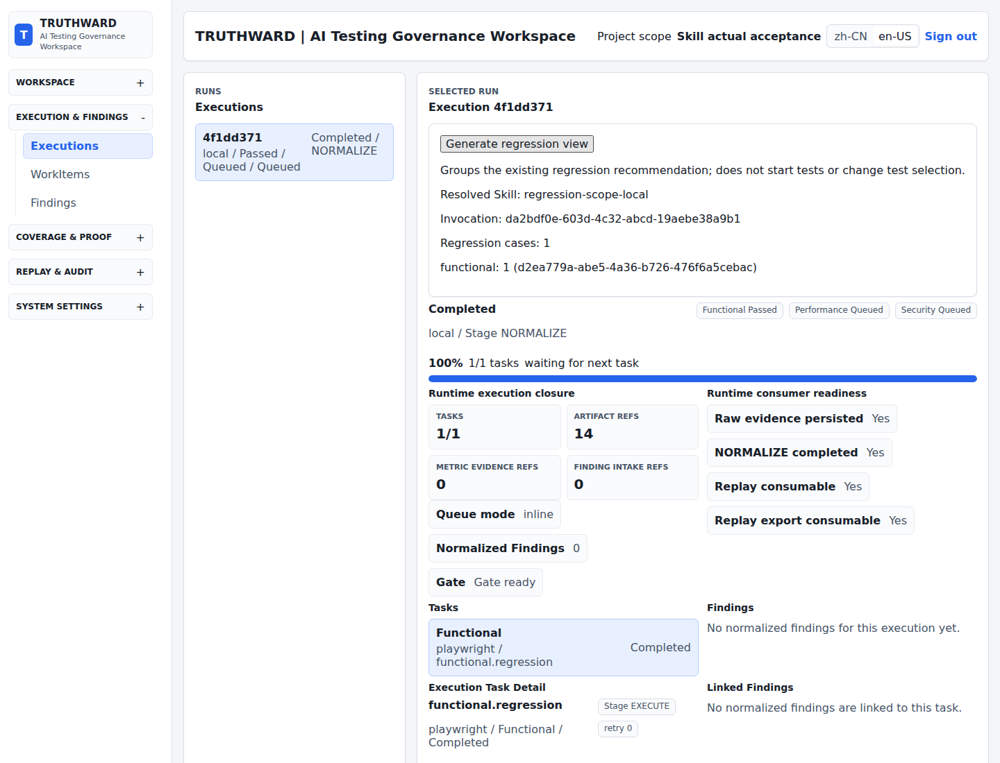
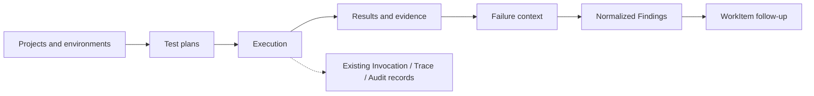
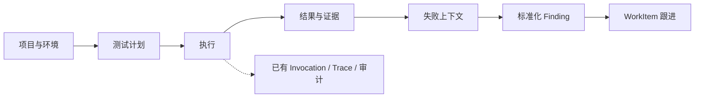

<h1 align="center">TRUTHWARD · 谛序</h1>

<p align="center"><strong>Community · Self-hosted, evidence-grounded AI testing</strong></p>

<p align="center">
  <a href="#english">English</a> · <a href="#简体中文">简体中文</a>
</p>

## English

| Question | Short answer |
| --- | --- |
| What is it? | The Community OSS edition is a self-hosted testing workspace for projects, plans, restricted execution, results, evidence, Findings, and WorkItem follow-up. |
| What problem does it solve? | It keeps execution context, artifacts, failure records, and follow-up connected instead of scattering them across logs, screenshots, and separate tools. |
| What can I see in 30 seconds? | Open the verified screenshot below to see regression cases from a real Playwright run grouped by a local Skill, with the resolved Skill and Invocation record visible. |
| How do I run it now? | Use the [fresh-install quick start](#quick-start), then reproduce the [real browser example](examples/community-browser/README.md). |

[Quick start](#quick-start) · [Who it is for](#who-community-is-for) · [Edition boundary](#community-basic-and-enterprise) · [Public benchmark](#public-quality-benchmark) · [Troubleshooting](#troubleshooting) · [User guide (Chinese)](docs/OSS_USER_GUIDE.md)



Isolated acceptance instance: local Skill grouping and Invocation records after a real Playwright functional execution. The screenshot shows the Chinese interface; it is evidence from the named acceptance run, not a product-wide availability claim.

### Who Community is for

| Good fit | Not a good fit yet |
| --- | --- |
| Individuals and small teams evaluating a self-hosted, source-visible testing workflow | Teams looking for a hosted SaaS or a prebuilt application/container image |
| Teams willing to configure their own models, browsers, scanners, and SCM credentials | Public or high-availability production deployments that need managed ingress, TLS, upgrades, backup automation, or on-call support out of the box |
| Contributors reproducing contracts, examples, and the transparent public quality benchmark | Organizations that require Enterprise IAM, approval-backed high-risk governance, managed Replay/Scheduler, or controlled autonomy in the Community composition |
| Fresh single-instance evaluation or development installations | In-place upgrades of an existing database using the quick-start procedure |

### Community, Basic, and Enterprise

| Edition | Boundary |
| --- | --- |
| Community | The self-hosted OSS composition: local identity, project/environment scope, test plans, restricted execution, evidence and issue follow-up, scoped model/SCM configuration, trusted local data-only Skills, and explicitly included read-only projections. |
| Basic | A separate commercial edition with project-scoped read-only governance capabilities. `DEPLOYMENT_PROFILE=oss` does not mean Basic. |
| Enterprise | Reserved proprietary extensions for cross-organization and higher-risk governance, including private registries, Skill evaluation/Shadow, approval-backed activation, managed Replay/Scheduler, rollback automation, and controlled autonomy where explicitly available. |

Backend capabilities, scope authorization, and route composition enforce these boundaries; frontend visibility is only a usability aid. Security controls such as authentication, scope checks, redaction, Secret references, Guardrails, idempotency, and fail-closed behavior remain Community requirements, not Enterprise add-ons. See the [functional layering contract](docs/OSS_FUNCTIONAL_LAYERING.md).

### Recorded baseline and current limits

- **Last recorded end-to-end candidate:** an exact clean bundle for commit `701bd58112eb7baa3f3ddf383a281dacd2905982` was exercised on Ubuntu 24.04 with Python 3.12.14 and Node.js 22.23.2. PostgreSQL 16, Redis 7, and Docker Compose v2 were covered by the recorded Community installation acceptance. These results establish the installation baseline; they are not exact-commit release evidence for a newer working tree.
- **Supported versions:** Python 3.11–3.14 and Node.js 22.13+ or 24 LTS. A supported version is not a claim that every operating-system and dependency combination was release-tested.
- **Installation boundary:** source-only, fresh empty database, localhost-first, development frontend, and single-process inline execution. No prebuilt application image, automatic upgrade path, public ingress, TLS, automatic restart, or high-availability configuration is supplied.
- **Integration boundary:** the base install does not make models, browsers, scanners, or external SCM calls available. The recorded provider acceptance covers the named local Ollama setup; hosted/external Providers remain unverified.
- **Community boundary:** high-risk approval workflows, managed Replay/Scheduler, complete audit event coverage, Skill evaluation/Shadow/automatic rollback, and controlled autonomy are not exposed by the Community composition.

### Why TRUTHWARD

- **Run a complete testing workflow**: organize project and environment scope, create plans, execute tests, inspect results, and follow up on issues.
- **Preserve evidence at the source**: connect tasks, artifacts, failure context, Invocations, Traces, and existing audit details produced by actual runs.
- **Turn failures into structured work**: normalize tool output into Findings and carry confirmed issues into WorkItems instead of leaving investigation in raw logs.
- **Use AI and extensions under control**: bind models by scope and let Services authorize and manage structured Agent and Skill requests.


```mermaid
flowchart LR
    P[Projects and environments] --> T[Test plans]
    T --> E[Execution] --> R[Results and evidence]
    R --> C[Failure context] --> F[Normalized Findings] --> W[WorkItem follow-up]
    E -.-> O[Existing Invocation / Trace / Audit records]
```

Execution, evidence, and failure analysis are not separate products: they are successive
parts of one testing workflow. Models, Skills, runners, and governance controls support
that workflow; they are not substitutes for it.

### Available capabilities

| Capability | What Community provides |
| --- | --- |
| Local identity | First-admin setup, login/logout, revocable tokens, local users, and fixed project roles |
| Projects and environments | Creation, configuration, membership management, and project scope selection |
| Tests and issues | Test plans, restricted execution/cancellation, Findings, and WorkItem tracking |
| Traceability | Workflows, execution records, audit event details, runtime observations, and read-only analysis of existing data |
| Model bindings | Project/environment configuration with PRIMARY, CHALLENGER, JUDGE, and LOCAL_FALLBACK roles |
| Controlled Skills | Trusted local JSON registration; explicit enable/disable for regression presentation bindings, business workflow calls, and Invocation observation |
| SCM configuration | Scoped GitHub/GitLab bindings and safe configuration projections |

See the [Community user guide (Chinese)](docs/OSS_USER_GUIDE.md) for workflows and current limitations.

### Quick start

These steps target a **fresh, single-instance installation on Linux using Bash**.
The last recorded end-to-end environment was Ubuntu 24.04 with Python 3.12; a newer
candidate must still pass its own exact-commit acceptance before publication.
This procedure does not upgrade an existing database, and no prebuilt application image is provided.

> **Scope:** this quick start is an evaluation/development setup. On a remote server the
> processes run on that server, but they still bind only to the server's `127.0.0.1` and
> are reached through the SSH tunnel in step 5. It does not configure public ingress,
> TLS, automatic restart, or high availability. See the
> [installation and operations guide](docs/COMMUNITY_INSTALLATION.md#停止备份与服务器部署边界)
> before planning a long-running or public deployment.

#### 1. Prepare the environment

- Python 3.11–3.14; `backend/pyproject.toml` defines the supported range.
- Node.js 22.13+ or Node.js 24 LTS, plus npm. Release evidence is produced with Node.js 22.
- Docker Engine and Compose v2 to run PostgreSQL 16 and Redis 7.
- Network access to dependency registries and container image registries.

Verify the commands before creating configuration:

```bash
python3 --version
node --version
npm --version
docker --version
docker compose version
docker info >/dev/null
```

On Ubuntu 24.04, Docker Engine may be installed without the Compose v2 plugin. If
`docker compose version` reports that `compose` is unknown, install the distribution
package and rerun the checks:

```bash
sudo apt-get update
sudo apt-get install docker-compose-v2
```

Package names differ for Docker's upstream repository and other distributions; do not
silently substitute the legacy `docker-compose` v1 command.

Database initialization runs directly in Python using the PostgreSQL driver installed with the backend dependencies.
Windows uses the same source package; see the [Windows compatibility notes (Chinese)](docs/COMMUNITY_INSTALLATION.md#windows-兼容说明).

Obtain the complete Community source from a published source archive or a GitHub checkout:

```bash
git clone --depth 1 https://github.com/TRUTHWARD/TRUTHWARD.git
cd TRUTHWARD
git rev-parse HEAD
```

The shallow default-branch checkout is convenient for evaluation. For a repeatable
installation, use a published signed Community tag or source archive, record the commit,
and verify its published SHA-256 instead of relying on a moving branch.

If you use an archive, extract it and enter the root directory containing this README.
Keep the full directory, including `schemas/contracts/`, `DB_SCHEMA.sql`, `scripts/migrations/`, and `community-skills/`.
Do not copy only the backend directory or replace the source runtime directory with a wheel.

#### 2. Create a Python environment

```bash
python3 -m venv backend/.venv
source backend/.venv/bin/activate
```

All subsequent `python` commands refer to this virtual environment. Activate it in any new terminal that runs Python commands.

#### 3. Generate configuration and install dependencies

```bash
python scripts/community.py configure
python -m pip install --require-hashes -r backend/requirements.lock
npm --prefix frontend ci
```

The configuration command checks the Python version, generates separate random database and Redis passwords,
and writes a local `.env` file. It refuses to overwrite an existing `.env`.
This does not create an application account; there is no shared administrator password.

#### 4. Start dependencies and initialize an empty database

```bash
docker compose --env-file .env -f compose.community.yml up -d --wait
python scripts/community.py init-db
python scripts/community.py doctor
```

PostgreSQL defaults to local port `55432` and Redis to `56379`; both bind only to `127.0.0.1`.
If those ports are occupied, use `configure --database-port 55433 --redis-port 56380` when first generating configuration.

Initialization verifies the bundled SQL checksum manifest and records each successful migration in the database ledger.
**It refuses to run when existing application tables are found and does not delete data.**
Do not run `init-db` against an existing deployment or delete a database to resolve initialization or login errors.
`doctor` performs credential-safe read-only checks of the Community profile, source assets,
tooling, database connection, and exact migration ledger. It does not repair or migrate data.

#### 5. Start the backend and frontend

In the first terminal, from the source root with the Python environment activated:

```bash
python scripts/community.py serve
```

In a second terminal, from the source root:

```bash
npm --prefix frontend run dev -- --mode oss --host 127.0.0.1
```

Open the [workspace](http://127.0.0.1:5173). Use the backend [API documentation](http://127.0.0.1:8000/docs)
and [health endpoint](http://127.0.0.1:8000/api/v1/health) to troubleshoot startup.
The API serves only Community routes. Demo credentials such as `admin-token` and `user-token` cannot authenticate.

For an installation on a remote Linux server, open another terminal on your own computer and establish an SSH tunnel.
Replace `user@your-server` with your server login address, then open the localhost URLs above:

```bash
ssh -N -L 5173:127.0.0.1:5173 -L 8000:127.0.0.1:8000 user@your-server
```

The browser then connects to local ports that SSH forwards to the remote server's
loopback ports. The `127.0.0.1` URLs do not mean that the application was installed on
your workstation. Do not expose the Vite development server, PostgreSQL, or Redis directly.

#### 6. Verify the installation

From the machine running the application, or through the tunnel, check the documented
read-only endpoints:

```bash
curl -fsS http://127.0.0.1:8000/api/v1/health
curl -fsS http://127.0.0.1:8000/api/v1/readiness
curl -fsS http://127.0.0.1:8000/api/v1/auth/bootstrap-status
curl -sS -o /dev/null -w "%{http_code}\n" http://127.0.0.1:8000/api/v1/auth/me
```

Health must report `healthy`, bootstrap status must initially report
`bootstrapRequired=true`, and unauthenticated `/auth/me` must return `401`. Readiness may
truthfully retain deployment-specific items, but an exact Community source package must
not report missing maintainer-only CI entrypoints.

#### 7. Stop the local instance

Press Ctrl+C in both application terminals, then stop the dependencies:

```bash
docker compose --env-file .env -f compose.community.yml stop
```

This preserves database volumes and local files. Avoid commands that remove volumes unless you intend to delete their data.
See the [installation and operations guide (Chinese)](docs/COMMUNITY_INSTALLATION.md) for backups, external databases, and public deployment considerations.

### Troubleshooting

| Symptom | First check |
| --- | --- |
| `configure` refuses to overwrite | An existing `.env` is being preserved. Use a fresh directory for a fresh install; do not replace an existing instance's configuration by force. |
| `docker compose` is unknown | Install the Compose v2 plugin and repeat the prerequisite checks; do not silently switch to legacy Compose v1. |
| `init-db` reports a non-empty database | Stop and point the fresh-install flow at a new isolated database. Do not delete tables or edit the migration ledger to bypass the check. |
| `doctor` returns `blocked` | Read `blockedChecks` and correct the named dependency, configuration, or migration state; `doctor` is intentionally read-only. |
| Login returns `401` | Use the administrator/user you created locally. Demo bearer values are rejected, and expired or revoked tokens require a new login. |
| A model, browser, scanner, or SCM operation is unavailable | Configure and verify that dependency separately. Successful base installation is not evidence that an external capability is ready. |

Keep error codes and a redacted minimal reproduction. Do not paste `.env`, DSNs, tokens, credentials, or customer data into a public report. See the [full installation troubleshooting table](docs/COMMUNITY_INSTALLATION.md#故障排查) and [support routes](SUPPORT.md).

### First steps

1. Create an administrator on the first-start page with a password of at least 12 characters. Keep your username or email.
2. Create a project and an environment. The top project selector appears only when multiple projects exist.
3. Add an available provider in model configuration, bind roles, and run a connection check.
4. In Workflow, create a test plan with a real browser assertion template, target URL, and element locator, then start its functional execution.
5. Inspect the Execution status, failure reasons, and evidence. Follow up on Findings or create a WorkItem.
6. Expand audit event details to inspect the objects, statuses, linked IDs, and redacted data actually recorded.

**A successful base installation does not mean that models and all test tools are ready.**
Configure API keys, providers, browsers, or scanners for the test types you need.
Missing dependencies must appear as unavailable/failed; they do not constitute a passing test.
The browser form provides visibility and text assertions. Simulated tasks are not evidence that a business test passed.
Start with the [runnable browser example](examples/community-browser/README.md): it supplies a local target,
a complete plan, and a script that checks the actual task and its report, screenshot, and trace.
Then find the saved Execution and artifacts in the UI. A missing dependency or failed assertion must remain visible as a failure.
See [real browser execution (Chinese)](docs/COMMUNITY_INSTALLATION.md#真实浏览器执行) for browser installation and setup.

### Use your own AI models

Model configuration prefers an environment binding, then falls back to the project default.
A project can configure multiple models with different roles.
Secrets are supplied through runtime environment or credential references and are not returned in configuration listings.

Role bindings do not mean that every run calls every model, and successful configuration does not prove that a real provider request succeeded.
Check both connection results and actual run results. The `LOCAL_FALLBACK` role name does not itself enable automatic fallback.

The recorded acceptance for commit `701bd58112eb7baa3f3ddf383a281dacd2905982`
included a real business call with local Ollama 0.11.10 and `qwen2.5:0.5b`: the scoped model passed a live health probe,
the Community business execution completed, and 2 of 2 persisted ModelInvocations
were live and bound to the selected model. This evidence is not automatically inherited
by later candidates. Hosted/external Providers remain unverified.
See [Provider verification](docs/COMMUNITY_PROVIDER_VERIFICATION.md) for the exact
candidate, evidence boundary, and requirements for validating another Provider.

### Controlled Skills

Community's first available local extension is **regression recommendation presentation**.
It groups regression cases already selected by the Service by domain or priority and controls whether case IDs are displayed.
It preserves test selection, risk conclusions, and execution tasks.

To use the bundled `regression-scope-local.example.json` version 1.1.0:

1. Register the local Manifest on the Capability Bindings page, then select the regression scope extension point and the Skill.
2. Choose a project or environment, create a draft Binding, and explicitly enable it.
3. Open an Execution and generate its regression view. Inspect the grouping, resolved Skill, and Invocation ID.
4. Inspect the actual Binding and frozen version in the Invocation. Disable the Binding when it is no longer needed.

Disabling affects subsequent calls and preserves historical results.
Before enabling, the backend validates permissions, scope, version/hash, kill switches, and the presentation contract.
Registration or draft creation alone does not make a Skill participate in calls.
See [local Skills](community-skills/README.md) for configuration fields and version changes.

Agents only produce Skill Requests; Services manage authorization, resolution, and invocation.
Local extensions require empty `allowedTools` and `allowedConnectors` lists.
They cannot contain scripts, arbitrary uploaded code, remote fetching, external writes, or database/Memory/Gate permissions.

Explicit enablement currently applies only to this fixed presentation extension.
It does not provide an arbitrary custom executor entry point.
Community does not expose approval-based activation, Shadow, or automatic rollback controls.

### Public quality benchmark

The Community source candidate includes a transparent benchmark sample, an auditable truth set with seven known defects and three safe negative controls, and a versioned reference result. The reference deliberately includes false positives and false negatives and is classified `contract_only`; it is a measurable baseline, not proof that every product workflow or external Provider passed.

Inspect the [loopback-only sample and safety notes](examples/public_quality_benchmark/README.md), the [expected findings](benchmarks/public_quality/expected-findings.v1.json), and the [reference result](benchmarks/public_quality/results/reference-result.v1.json) directly. To explore the sample locally:

```bash
python examples/public_quality_benchmark/app.py --port 8765
```

The source-only Community package does not claim a complete local-actual benchmark run. Maintainer-only scoring and release commands are intentionally not documented as Community package commands.

### Security and known limitations

- Frontend visibility is not authorization. The backend validates capabilities, project membership, and environment ownership.
- Complete first-admin setup before exposing the service publicly. The default startup listens only on localhost.
- Do not commit `.env`, database backups, tokens, provider keys, or logs containing personal data.
- Audit details show only recorded, redacted data. Missing historical fields remain unrecorded; successful states are never fabricated.
- The audit read projection is available, but complete event coverage and unified project-scoped audit isolation remain incomplete.
- The example uses a development frontend and single-process inline execution. It is not a high-availability production deployment.

### Documentation and contributions

- [Community user guide (Chinese)](docs/OSS_USER_GUIDE.md)
- [Installation, backups, and troubleshooting (Chinese)](docs/COMMUNITY_INSTALLATION.md)
- [Trusted local Skill Manifests](community-skills/README.md)
- [Runnable browser example](examples/community-browser/README.md)
- [Public quality benchmark sample and safety notes](examples/public_quality_benchmark/README.md)
- [Provider verification](docs/COMMUNITY_PROVIDER_VERIFICATION.md)
- [Contribution guide](CONTRIBUTING.md)
- [Code of Conduct](CODE_OF_CONDUCT.md)
- [Support and issue routing](SUPPORT.md)
- [Security policy and private vulnerability reporting](SECURITY.md)

Usage questions and proposals belong in GitHub Discussions; reproducible bugs belong in GitHub Issues.
Contributions addressing reproducible issues, tests, and documentation are welcome. Include the version,
redacted error codes, and minimal reproduction steps when reporting an issue. Report vulnerability details
only through the private process in the security policy; do not publicly post credentials or exploit steps.

Built with FastAPI, SQLAlchemy, PostgreSQL, React, TypeScript, and Vite.
Build the frontend with `npm --prefix frontend run build:oss`; the backend still requires the complete source directory at runtime.

### Licensing and release integrity

Formal Community source releases use the [Apache License 2.0](release/oss/LICENSE).
The license and scope statements included with the package you receive govern its coverage;
this page does not change the licensing of files outside that grant.
Official Community source releases include [NOTICE](release/oss/NOTICE), the
[third-party license review](release/oss/third_party_licenses.json),
`SBOM.spdx.json`, and `OSS_SOURCE_PROVENANCE.json`.
Prebuilt binaries and container images are not currently distributed.

TRUTHWARD and 谛序 identify the project. The Apache License 2.0 does not grant rights to project names or wordmarks.

---

## 简体中文

[English](#english) | [简体中文](#简体中文)

| 问题 | 简短回答 |
| --- | --- |
| 这是什么？ | 一套可自托管、源码可见的测试工作台，覆盖项目、计划、受限执行、结果、证据、Finding 和 WorkItem 跟进。 |
| 解决什么痛点？ | 把执行上下文、产物、失败记录和后续处理连在一起，避免它们散落在日志、截图和不同工具中。 |
| 30 秒内能看到什么？ | 直接看下方已验证截图：真实 Playwright 执行产生的回归用例经过本地 Skill 分组，并展示实际解析到的 Skill 和 Invocation 记录。 |
| 现在如何运行？ | 按[全新安装快速开始](#快速开始)启动，再复现[真实浏览器示例](examples/community-browser/README.md#简体中文)。 |

[快速开始](#快速开始) · [适用对象](#community-fit-zh) · [版本边界](#edition-boundary-zh) · [公开基准](#public-benchmark-zh) · [故障排查](#troubleshooting-zh) · [使用指南](docs/OSS_USER_GUIDE.md)


隔离验收实例：真实 Playwright 功能执行后的本地 Skill 分组结果与 Invocation。该图只证明所述验收运行，不代表所有产品能力或外部依赖均已可用。

<a id="community-fit-zh"></a>

### 谁适合使用 Community

| 适合 | 当前不适合 |
| --- | --- |
| 希望评估可自托管、源码可见测试流程的个人和小团队 | 希望直接使用托管 SaaS 或预构建应用/容器镜像的团队 |
| 愿意自行配置模型、浏览器、扫描器与 SCM 凭据的团队 | 要求开箱即用的公网入口、TLS、高可用、自动升级、自动备份或值班支持的生产部署 |
| 希望复现公开契约、示例和透明质量基准的贡献者 | 必须在 Community composition 中使用企业 IAM、审批型高风险治理、受管 Replay/Scheduler 或 controlled autonomy 的组织 |
| 全新单实例评估或开发安装 | 希望用快速开始对已有数据库做原地升级的场景 |

<a id="edition-boundary-zh"></a>

### Community、Basic 与 Enterprise 边界

| Edition | 边界 |
| --- | --- |
| Community | OSS 自托管 composition：本地身份、项目/环境范围、测试计划、受限执行、证据与问题跟进、作用域模型/SCM 配置、可信本地 data-only Skill，以及明确纳入的只读投影。 |
| Basic | 独立商业 edition，保留项目级只读治理能力；`DEPLOYMENT_PROFILE=oss` 不代表 Basic。 |
| Enterprise | 为跨组织和更高风险治理保留的专有扩展，包括私有 Registry、Skill Evaluation/Shadow、审批型激活、受管 Replay/Scheduler、回滚自动化和在明确开放时的 controlled autonomy。 |

版本边界由后端 capability、作用域授权和路由 composition 强制执行；前端显隐只改善使用体验。认证、作用域检查、脱敏、Secret ref、Guardrail、幂等和 fail-closed 等安全控制仍是 Community 的必要边界，不是 Enterprise 附加项。详见[功能分层契约](docs/OSS_FUNCTIONAL_LAYERING.md)。

### 已记录基线与当前限制

- **最近一次完整候选验收：**commit `701bd58112eb7baa3f3ddf383a281dacd2905982` 的精确 clean bundle 已在 Ubuntu 24.04、Python 3.12.14、Node.js 22.23.2 上运行；已记录的 Community 安装验收还覆盖 PostgreSQL 16、Redis 7 和 Docker Compose v2。这些结果建立安装基线，不是更新工作树的 exact-commit 发行证据。
- **支持版本：**Python 3.11–3.14，Node.js 22.13+ 或 24 LTS。支持范围不等于每种操作系统与依赖组合都已完成发行验证。
- **安装边界：**仅源码、全新空数据库、localhost 优先、开发前端、单进程 inline 执行；不提供预构建应用镜像、自动升级、公网入口、TLS、自动重启或高可用配置。
- **集成边界：**基础安装不会自动提供模型、浏览器、扫描器或外部 SCM 调用。已记录的 Provider 验收只覆盖文档点名的本地 Ollama 配置；托管/外部 Provider 仍未验证。
- **Community 边界：**高风险审批流程、受管 Replay/Scheduler、完整审计事件覆盖、Skill Evaluation/Shadow/自动回滚和 controlled autonomy 不进入当前 Community composition。

### 为什么使用谛序

- **跑通完整测试流程**：管理项目和环境范围，创建计划、执行测试、查看结果并跟进问题。
- **从执行源头保留证据**：关联任务、产物、失败上下文、Invocation、Trace 和已有审计详情。
- **把失败转成结构化工作**：将工具输出归一化为 Finding，再把确认的问题带入 WorkItem，而不是停留在原始日志中。
- **受控使用 AI 与扩展能力**：按范围绑定模型，由 Service 对 Agent 和 Skill 的结构化请求进行授权和托管。


```mermaid
flowchart LR
    P[项目与环境] --> T[测试计划]
    T --> E[执行] --> R[结果与证据]
    R --> C[失败上下文] --> F[标准化 Finding] --> W[WorkItem 跟进]
    E -.-> O[已有 Invocation / Trace / 审计]
```

执行、证据和失败分析不是三个割裂的产品，而是同一测试流程中连续发生的环节。模型、Skill、
执行器和治理能力用于支撑这条流程，不能替代测试流程本身。

### 当前支持

| 能力 | Community 提供什么 |
| --- | --- |
| 本地身份 | 首次管理员、登录/登出、可撤销 Token、本地用户和固定项目角色 |
| 项目与环境 | 创建、配置、成员管理与项目范围切换 |
| 测试与问题 | 测试计划、受限执行/取消、Finding、WorkItem 流转 |
| 可追溯性 | Workflow、执行记录、审计事件详情和运行观测；已有数据的只读分析 |
| 多模型绑定 | 项目/环境级配置，PRIMARY、CHALLENGER、JUDGE、LOCAL_FALLBACK 角色 |
| 受控 Skill | 可信本地 JSON 注册；回归展示 Binding 显式启用/停用、业务调用与 Invocation 观察 |
| SCM 配置 | GitHub、GitLab 的项目/环境级绑定与安全配置投影 |

具体操作和当前限制见 [Community 使用指南](docs/OSS_USER_GUIDE.md)。

### 快速开始

以下步骤以 **Linux / Bash 下的全新单实例安装**为主。最近一次完整记录使用
Ubuntu 24.04 / Python 3.12；更新候选版本仍须在发布前完成自己的 exact-commit 验收。
它不是现有数据库的升级步骤，也不提供预构建应用镜像。

> **适用范围：**这是一条评估/开发用途的快速安装流程。安装在远程服务器时，进程确实
> 运行在服务器上，但仍只监听服务器自己的 `127.0.0.1`，通过第 5 步的 SSH 隧道访问。
> 本流程不配置公网入口、TLS、自动重启或高可用。计划长期运行或公网访问前，请先阅读
> [安装与运行说明](docs/COMMUNITY_INSTALLATION.md#停止备份与服务器部署边界)。

#### 1. 准备环境

- Python 3.11–3.14（支持范围以 `backend/pyproject.toml` 为准）。
- Node.js 22.13+ 或 Node.js 24 LTS，以及 npm；发布证据固定使用 Node.js 22 生成。
- Docker Engine 与 Compose v2；用于启动 PostgreSQL 16、Redis 7。
- 可访问依赖包与容器镜像源的网络。

生成配置前先确认所有命令可用：

```bash
python3 --version
node --version
npm --version
docker --version
docker compose version
docker info >/dev/null
```

Ubuntu 24.04 可能只安装了 Docker Engine，没有 Compose v2 插件。如果
`docker compose version` 提示 `compose` 未知，安装发行版软件包后重新检查：

```bash
sudo apt-get update
sudo apt-get install docker-compose-v2
```

Docker 官方仓库或其他发行版的软件包名称可能不同；不要静默改用旧版
`docker-compose` v1 命令。

数据库初始化由 Python 直接执行，使用后端依赖中已安装的 PostgreSQL 驱动。
Windows 使用相同源码包，操作差异见 [Windows 兼容说明](docs/COMMUNITY_INSTALLATION.md#windows-兼容说明)。

从已发布源码归档或 GitHub 获取完整 Community 源码：

```bash
git clone --depth 1 https://github.com/TRUTHWARD/TRUTHWARD.git
cd TRUTHWARD
git rev-parse HEAD
```

浅克隆默认分支适合快速评估。需要可重复部署时，应选择已发布且签名的 Community tag
或源码归档，记录 commit 并校验发布的 SHA-256，不能把持续移动的分支当作发布证据。

使用归档时，解压后进入包含本 README 的根目录。保留整个目录，尤其是
`schemas/contracts/`、`DB_SCHEMA.sql`、`scripts/migrations/` 和 `community-skills/`。
不要只复制后端目录或用一个 wheel 替代源码运行目录。

#### 2. 创建 Python 环境

```bash
python3 -m venv backend/.venv
source backend/.venv/bin/activate
```

后面的 `python` 均指这个虚拟环境中的解释器。后续打开的新终端也需要先激活它。

#### 3. 生成配置并安装依赖

```bash
python scripts/community.py configure
python -m pip install --require-hashes -r backend/requirements.lock
npm --prefix frontend ci
```

配置命令检查 Python 版本，为数据库与 Redis 生成独立随机密码，写入本地 `.env`。
已有 `.env` 会被拒绝覆盖。这里不创建应用账号，也不存在通用管理员密码。

#### 4. 启动依赖并初始化空数据库

```bash
docker compose --env-file .env -f compose.community.yml up -d --wait
python scripts/community.py init-db
python scripts/community.py doctor
```

默认 PostgreSQL 使用本机 `55432`，Redis 使用 `56379`；均只绑定 `127.0.0.1`。
端口占用时，在首次生成配置时使用 `configure --database-port 55433 --redis-port 56380`。

初始化先验证包内 SQL 校验清单，再将每个成功迁移记录到数据库账本。**发现已有业务表时会拒绝执行，不删除数据。**
不要对已有部署使用 `init-db`，也不要通过删库处理初始化或登录错误。
`doctor` 会对 Community profile、源码资源、工具、数据库连接和精确迁移账本执行凭据安全的
只读检查；它不会修复或迁移数据。

#### 5. 启动前后端

第一个终端，在源码根目录并激活 Python 环境后：

```bash
python scripts/community.py serve
```

第二个终端，在源码根目录：

```bash
npm --prefix frontend run dev -- --mode oss --host 127.0.0.1
```

打开 [工作台](http://127.0.0.1:5173)。后端 [API 文档](http://127.0.0.1:8000/docs)
和 [健康状态](http://127.0.0.1:8000/api/v1/health) 可用于排查启动问题。
API 只启动 Community 路由，`admin-token`、`user-token` 等演示身份不能登录。

如果安装在远程 Linux 服务器上，在自己的电脑另开终端建立 SSH 隧道
（将 `user@your-server` 替换为服务器登录地址），再打开上述本机地址：

```bash
ssh -N -L 5173:127.0.0.1:5173 -L 8000:127.0.0.1:8000 user@your-server
```

此时浏览器连接的是本机端口，SSH 会把流量转发到远程服务器的 loopback 端口。
URL 中的 `127.0.0.1` 不代表应用安装在个人电脑上。不要直接暴露 Vite 开发服务器、
PostgreSQL 或 Redis。

#### 6. 验证安装

在运行应用的机器上，或通过隧道，检查文档约定的只读接口：

```bash
curl -fsS http://127.0.0.1:8000/api/v1/health
curl -fsS http://127.0.0.1:8000/api/v1/readiness
curl -fsS http://127.0.0.1:8000/api/v1/auth/bootstrap-status
curl -sS -o /dev/null -w "%{http_code}\n" http://127.0.0.1:8000/api/v1/auth/me
```

Health 必须为 `healthy`；首次启动的 bootstrap status 必须为
`bootstrapRequired=true`；未认证 `/auth/me` 必须返回 `401`。Readiness 可以如实保留
deployment-specific 项，但精确 Community 源码包不得因为维护者专用 CI 入口未随包提供
而报告 `missing_dependency`。

#### 7. 停止本地实例

分别在前后端终端按 Ctrl+C，再停止依赖：

```bash
docker compose --env-file .env -f compose.community.yml stop
```

这会保留数据库卷和本地文件。不要随意使用删除卷的命令。
备份、外部数据库和公网部署注意事项见 [安装与运行说明](docs/COMMUNITY_INSTALLATION.md)。

<a id="troubleshooting-zh"></a>

### 故障排查

| 现象 | 优先检查 |
| --- | --- |
| `configure` 拒绝覆盖 | 已有 `.env` 被保留。全新安装请使用新目录，不要强行替换已有实例配置。 |
| 找不到 `docker compose` | 安装 Compose v2 插件并重新执行前置检查，不要静默改用旧版 Compose v1。 |
| `init-db` 提示数据库非空 | 停止并为全新安装指定新的隔离数据库；不要删表或修改迁移账本来绕过检查。 |
| `doctor` 返回 `blocked` | 查看 `blockedChecks`，修复点名的依赖、配置或迁移状态；`doctor` 只读，不会自动修复。 |
| 登录返回 `401` | 使用本地创建的管理员/用户；演示 bearer 会被拒绝，Token 过期或撤销后需重新登录。 |
| 模型、浏览器、扫描器或 SCM 操作 unavailable | 单独配置并验证对应依赖；基础安装成功不能证明外部能力已就绪。 |

保留错误码和脱敏后的最小复现；不要把 `.env`、DSN、Token、凭据或客户数据贴到公开报告。更多场景见[完整故障排查表](docs/COMMUNITY_INSTALLATION.md#故障排查)和[支持渠道](SUPPORT.md)。

### 完成第一次使用

1. 在首次启动页面创建管理员；密码至少 12 位。保存自己的用户名或邮箱。
2. 创建项目，再创建环境；只有多个项目时顶部才出现项目选择器。
3. 在模型配置中添加实际可用的 Provider，绑定角色，执行连接检查。
4. 在工作流中创建测试计划，选择真实浏览器断言模板，填写目标 URL 和元素定位信息，再启动功能执行。
5. 查看 Execution 的状态、失败原因与证据；有 Finding 时跟进问题或创建 WorkItem。
6. 在审计日志中展开事件详情，查看实际记录的对象、状态、关联 ID 和脱敏数据。

**基础安装成功不等于模型和所有测试工具已经可用。** API Key、Provider、浏览器或扫描器
需要按实际测试类型配置；缺失时应显示 unavailable/failed，不能把它当作测试通过。
浏览器表单提供可见性和文本断言，模拟任务不能作为业务测试通过证据。
可以先运行[真实浏览器示例](examples/community-browser/README.md#简体中文)：示例包含本地目标页面、
完整计划和验证脚本，会核对真实任务及 report、screenshot、trace，再到界面查看保存的执行和产物。
依赖缺失或断言失败必须如实显示为失败。浏览器安装与配置见 [真实浏览器执行](docs/COMMUNITY_INSTALLATION.md#真实浏览器执行)。

### 使用自己的 AI 模型

模型配置按环境优先、项目默认回退；可为同一项目配置多个模型并绑定不同角色。
密钥通过运行时环境或凭据引用提供，不通过配置列表回显。

角色绑定不等于每次运行都调用所有模型；配置成功也不等于真实 Provider 请求成功。
请分别确认连接检查和实际运行结果。`LOCAL_FALLBACK` 角色名称本身不代表自动回退已启用。

commit `701bd58112eb7baa3f3ddf383a281dacd2905982` 的已记录验收使用本地
Ollama 0.11.10 与 `qwen2.5:0.5b` 完成真实业务调用：
作用域模型通过 live 健康检查，Community 业务执行完成，2/2 次持久化
ModelInvocation 均为 live 且绑定到所选模型。后续候选版本不能自动继承这份证据；
托管/外部 Provider 仍未验证。
精确候选版本、证据边界和其他 Provider 的验收要求见
[模型验证记录](docs/COMMUNITY_PROVIDER_VERIFICATION.md#简体中文)。

### 受控 Skill

Community 的首个可用本地扩展是**回归推荐展示**：对 Service 已选出的回归用例按
领域或优先级分组，并配置是否展示用例 ID。它不改变测试选择、风险结论或执行任务。

使用包内 `regression-scope-local.example.json` 1.1.0：

1. 在“能力绑定”页注册本地 Manifest，选择回归范围扩展点和该 Skill。
2. 选择项目或环境，创建草稿 Binding，然后点击“启用绑定”。
3. 打开一次 Execution，点击“生成回归展示”，查看分组结果、解析 Skill 和 Invocation ID。
4. 在 Invocation 中核对实际 Binding 与冻结版本；不再使用时点击“停用绑定”。

停用只影响后续调用，历史结果保留。启用时，后端会核验权限、作用域、版本/hash、
停止开关和展示契约；注册或创建草稿本身不代表参与调用。
配置字段和新版本切换步骤见 [本地 Skill](community-skills/README.md)。

Agent 只提出 Skill Request；权限校验、解析和调用由 Service 托管。
本地扩展要求 `allowedTools`、`allowedConnectors` 为空，不接受脚本、任意代码上传、
远程拉取、外部写入或数据库/Memory/Gate 权限。

当前显式启用仅适用于上述固定展示扩展，不是任意自定义执行器入口。
Community 不提供审批激活、Shadow 或自动回滚入口。

<a id="public-benchmark-zh"></a>

### 公开质量基准

Community 源码候选包包含透明 benchmark 样例、带 7 个已知缺陷和 3 个安全负对照的可审计 truth set，以及版本化参考结果。参考结果刻意保留 false positive 与 false negative，并标记为 `contract_only`；它是可测量基线，不代表所有产品工作流或外部 Provider 均已通过。

可直接检查[仅允许 loopback 的样例及安全说明](examples/public_quality_benchmark/README.md)、[expected findings](benchmarks/public_quality/expected-findings.v1.json)和[参考结果](benchmarks/public_quality/results/reference-result.v1.json)。本地查看样例：

```bash
python examples/public_quality_benchmark/app.py --port 8765
```

源码版 Community 不声称已经完成全部 local-actual benchmark；维护者专用评分与发行命令不会伪装成 Community 包内命令。

### 安全与已知限制

- 前端可见性不构成授权；服务端校验 capability、项目成员关系与环境归属。
- 初次管理员创建前不要将服务暴露到公网。默认启动只监听本机。
- 不提交 `.env`、数据库备份、Token、Provider 密钥或包含个人数据的日志。
- 审计详情只展示已记录且经脱敏的数据；历史缺失字段显示“未记录”，不会补造成功状态。
- 审计读取投影可用，但完整事件覆盖和统一项目作用域审计隔离仍未全部闭环。
- 示例启动使用开发前端和单进程 inline 执行，不是高可用生产部署方案。

### 文档与贡献

- [Community 使用指南](docs/OSS_USER_GUIDE.md)
- [安装、备份与故障排查](docs/COMMUNITY_INSTALLATION.md)
- [可信本地 Skill Manifest](community-skills/README.md)
- [可运行的真实浏览器示例](examples/community-browser/README.md#简体中文)
- [公开质量基准样例与安全说明](examples/public_quality_benchmark/README.md)
- [模型验证记录](docs/COMMUNITY_PROVIDER_VERIFICATION.md#简体中文)
- [贡献指南](CONTRIBUTING.md)
- [社区行为准则](CODE_OF_CONDUCT.md)
- [支持与问题分流](SUPPORT.md)
- [安全策略与私密漏洞报告](SECURITY.md)

使用问题和方案建议请进入 GitHub Discussions，可复现的软件缺陷请提交 GitHub Issue。
欢迎围绕可复现问题、测试和文档提出改进。提交问题时提供版本、脱敏后的错误代码和
最小复现步骤；安全漏洞细节只通过安全策略中的私密渠道报告，不要公开凭据或利用步骤。

技术栈：FastAPI、SQLAlchemy、PostgreSQL、React、TypeScript、Vite。
前端可使用 `npm --prefix frontend run build:oss` 构建；完整源码目录仍是后端运行要求。

### 许可证与发行完整性

正式 Community 源码发行采用 [Apache License 2.0](release/oss/LICENSE)。
具体授权以所获文件包随附的许可证及范围说明为准；本页不改变未获授权文件的许可。
正式 Community 源码发行随附 [NOTICE](release/oss/NOTICE)、
[第三方许可证审查清单](release/oss/third_party_licenses.json)、`SBOM.spdx.json`
与 `OSS_SOURCE_PROVENANCE.json`。
目前不提供预构建二进制文件或容器镜像。

TRUTHWARD 与“谛序”用于标识本项目；Apache License 2.0 不授予项目名称或标识的使用权。
